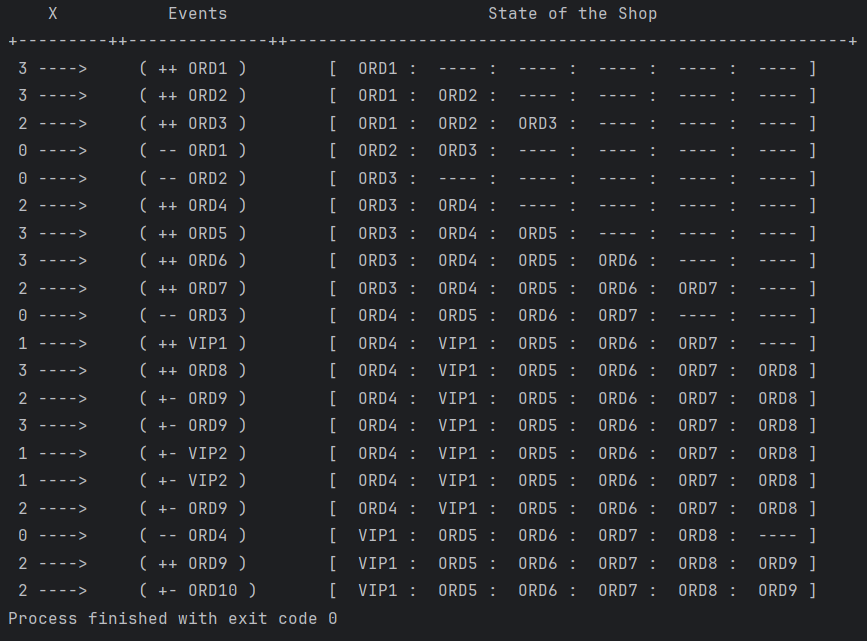

# Barbering Shop Simulation

This Java program simulates the functioning of a 
barbering shop according to the given rules. 
It keeps track of ordinary (ORD) and VIP clients, 
their seating arrangement, and the movement of clients 
within the shop.

## Features
- Randomly generates events when the space key is pressed:
    - `-- clientName`: Barber is done trimming the hair of the current client.
    - `++ VIPi`: VIP client has come into the shop and is seated.
    - `++ ORDi`: Ordinary client has come into the shop and is seated.
    - `+- clientName`: Client has come and gone back due to all seats being occupied.
    - `** NULL`: No client to be removed since there are no client seated.
        
- The seating and movement of customers in the salon follows these rules:
    - If a client enters an empty shop, they sit in the main chair for a haircut.
    - If the main chair is occupied, incoming clients wait their turn in available chairs, regardless of whether they are ordinary (ORD) or VIP.
    - A VIP client will take the first waiting chair if it’s available, causing any ORD client there to move back.
    - If there’s already a VIP in the queue, any new VIP will sit after the last VIP.
    - Once a client’s haircut is done, they leave the shop permanently.
    - After a client leaves the main chair, the next client in the first chair takes their place, and all waiting clients move forward to fill the empty chair.

## Usage

1. Run the program.
2. Press the space key to trigger an event.
3. The program will display the event along with the sitting order of clients in the shop.

## Requirements

- Java JDK installed.

## Simulation
